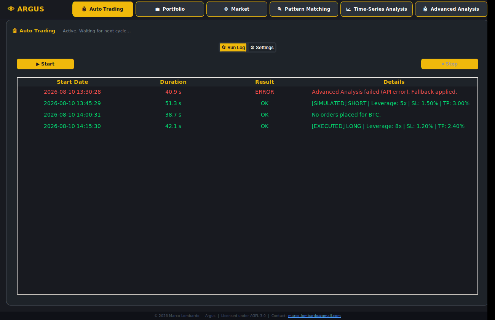
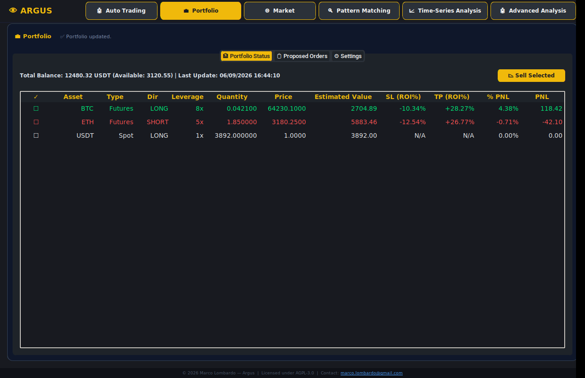
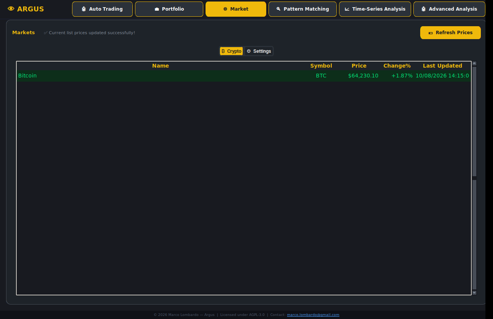
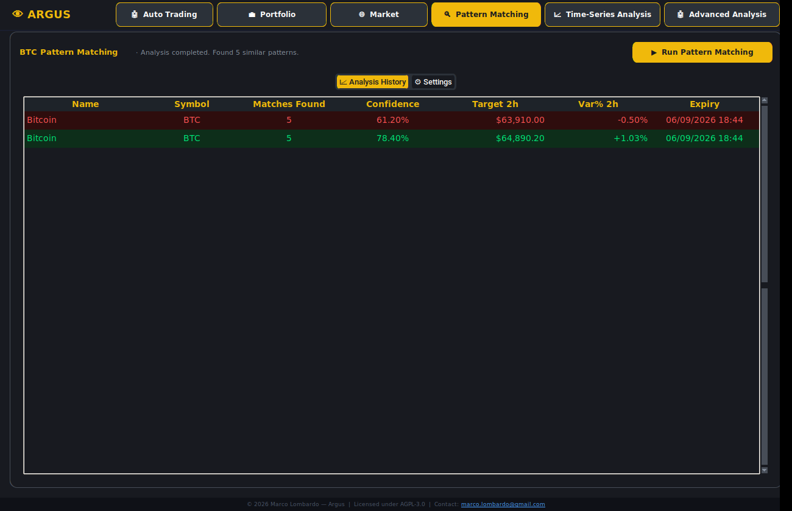
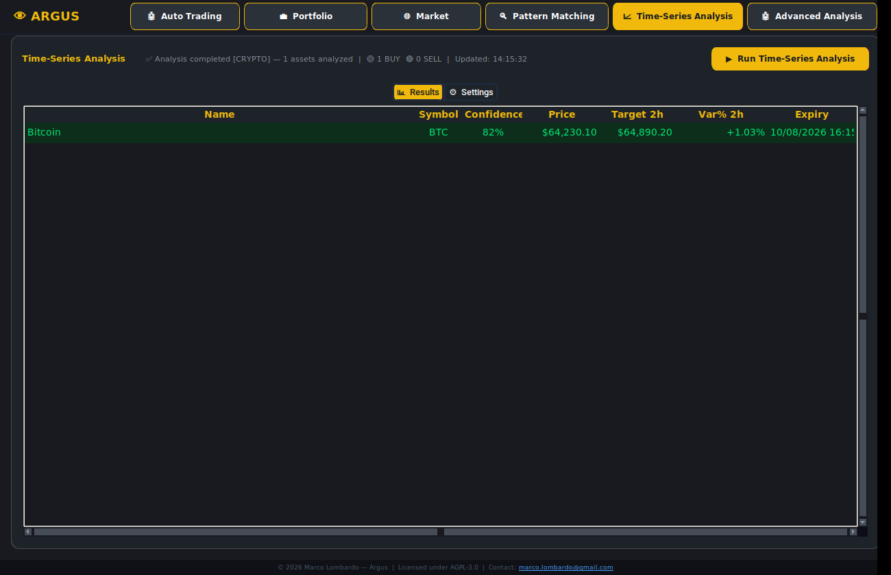
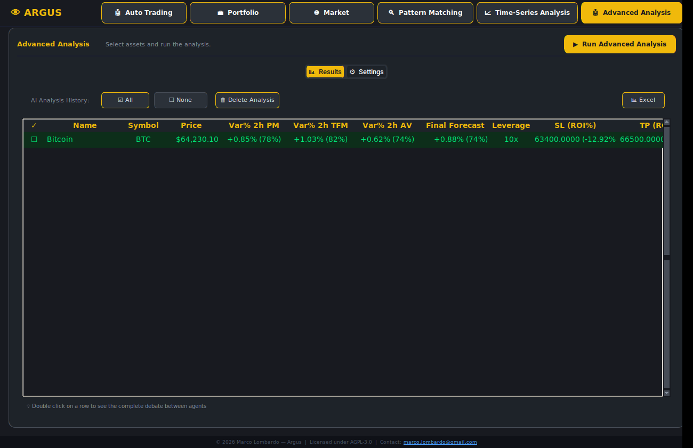

# 👁️ Argus — Advanced Market Forecast & AI Analysis

[](https://www.gnu.org/licenses/agpl-3.0)
[](COMMERCIAL-LICENSE.md)
[](https://www.python.org/downloads/)
[](https://github.com/MarcoLombardoDev/Argus/actions/workflows/ci.yml)

Quantitative price forecasting and AI-driven analysis of cryptocurrency assets, with an
integrated portfolio manager and an autonomous trading scheduler.

> ⚠️ The autonomous workflow currently trades **BTC only** — see
> [Scope and limitations](#scope-and-limitations) before relying on it, and read the
> [Disclaimer](#disclaimer) before pointing it at a funded account.
> 💼 Commercial or redistribution use (including OEM)? See [COMMERCIAL-LICENSE.md](COMMERCIAL-LICENSE.md),
> or write to [marco.lombardo@gmail.com](mailto:marco.lombardo@gmail.com?subject=Argus%20commercial%20licence%20enquiry).

---

## Screenshots

> The prices, balances and positions below are **synthetic sample data** generated purely to illustrate the layout — not a real account, not real market data, and not investment advice.

| | |
|---|---|
| **Auto Trading** — run log, live countdown to the next 15-minute cycle | **Portfolio** — Spot/Futures positions, leverage, SL/TP as ROI% |
|  |  |
| **Market** — live price table feeding the local 15m OHLCV cache | **Pattern Matching** — KNN move/confidence history on BTC |
|  |  |
| **Time-Series Analysis** — TimesFM 2-hour forecast | **Advanced Analysis** — multi-agent AI verdict, ensemble sizing |
|  |  |

<sub>Generated with [`docs/generate_screenshots.py`](docs/generate_screenshots.py), which boots the real app under Xvfb with in-memory sample data (no disk writes, no network calls). Regenerate after a UI change with `SHOTDIR=docs/screenshots xvfb-run -a python docs/generate_screenshots.py`.</sub>

---

## Table of Contents

1. [What Argus is](#what-argus-is)
2. [Features](#features)
3. [Download](#download)
4. [Installation from source](#installation-from-source)
5. [Usage](#usage)
6. [How it works](#how-it-works)
7. [Requirements](#requirements)
8. [Development](#development)
9. [Testing](#testing)
10. [Building a standalone executable](#building-a-standalone-executable)
11. [Troubleshooting](#troubleshooting)
12. [Scope and limitations](#scope-and-limitations)
13. [License & Commercial Licensing](#license--commercial-licensing)
14. [Contributing](#contributing)
15. [Disclaimer](#disclaimer)

---

## What Argus is

Argus is an advanced Python desktop application for **quantitative price forecasting and
AI-driven analysis** of cryptocurrency assets. It combines Google Research's **TimesFM
2.5** foundation model for temporal prediction, a cooperative **multi-agent LLM pipeline**
for qualitative analysis and debate, and a **built-in instant backtester** to constrain AI
decisions with real mathematical evidence.

On top of the analysis engine, Argus features a full **Portfolio Manager** integrated with
[CCXT](https://github.com/ccxt/ccxt) for generating and executing orders on derivatives
exchanges (e.g. BingX), with an institutional-grade money-management framework and a fully
autonomous **auto-trading scheduler**.

It runs entirely on your machine. The only services it contacts are the ones you configure:
your exchange, your LLM provider, and the market-data sources.

## Features

**Forecasting**
- **TimesFM 2.5** temporal forecast over the cached 15-minute BTC history, with
  quantile-derived confidence
- **KNN-DTW pattern matching** on normalised log-returns, with persistent match history
- **Instant backtest** of every proposed decision, with no dependency beyond pandas and
  NumPy

**AI analysis**
- A cooperative **six-agent LLM pipeline** that debates the qualitative case, readable
  in full — the whole debate is kept, not just its verdict
- **Ensemble engine** that weighs the quantitative and qualitative signals into one sizing
  decision
- News scraping and macro context feeding the analysts
- Export to Excel and PDF

**Portfolio and execution**
- Spot and Futures positions through **CCXT**: leverage, entry and current price,
  unrealised P&L, stop-loss and take-profit expressed as ROI%
- **Money management**: capital and position limits, sizing modes, risk percentage, DCA,
  stop-and-reverse, leverage and ROI caps
- **Pre-flight checker** — slippage guard and flash-orderbook detection before an order
  goes out
- **Auto-trading scheduler**, on the 15-minute candle, with a live countdown and a run log
- **Paper trading** by default: `useExchangeBalance = false` routes every order to a
  `SIMULATED` status instead of the exchange

**The application**
- One window, six views, each carrying its own ⚙️ Settings tab
- Every long operation runs on a worker thread and marshals UI updates back through a
  queue, so network calls and model inference never freeze the window
- **Secrets never touch `config/settings.json`** — API keys and tokens live in `.env`

## Download

Standalone builds for **Windows, macOS and Linux** are attached to every
[release](https://github.com/MarcoLombardoDev/Argus/releases):

| Platform | File |
|---|---|
| Windows (x64) | `Argus-<version>-windows-x64.zip` |
| macOS (Apple silicon) | `Argus-<version>-macos-arm64.zip` |
| Linux (x64) | `Argus-<version>-linux-x64.tar.gz` |

Each archive is built on that platform's own runner — PyInstaller does not cross-compile,
so nothing here is emulated or claimed for a platform that was not actually built. They
are packaged with a **CPU-only PyTorch**, so no NVIDIA GPU is required; that is also why
they are large.

Unpack and run: on first launch the program creates its own `data/` and `config/` folders
next to itself, so it stays portable. No installation, and no Python needed.

The builds are **unsigned**, so Windows SmartScreen and macOS Gatekeeper warn on first
launch.

> **Before adding live API keys**, read
> [Two sets of starting values](#two-sets-of-starting-values): the default configuration
> is *not* the same as the conservative template.

## Installation from source

### Prerequisites

- **Python 3.10 or higher**
- **Tk bindings** — `tkinter` ships with the official CPython installers on
  Windows and macOS, but on Linux it is a separate OS package and is **not**
  installable via pip:
  ```bash
  # Debian / Ubuntu
  sudo apt install python3-tk
  # Fedora / RHEL
  sudo dnf install python3-tkinter
  # Arch
  sudo pacman -S tk
  ```
- **RAM**: ≥ 8 GB recommended (TimesFM model requires significant memory)
- Internet connection for data providers and LLM API calls

### Steps

```bash
# 1. Clone the repository
git clone https://github.com/MarcoLombardoDev/Argus.git
cd Argus

# 2. Create and activate a virtual environment
python -m venv .venv
# Windows:
.venv\Scripts\activate
# macOS/Linux:
source .venv/bin/activate

# 3. Install dependencies
pip install -r requirements.txt

# 4. Start from the conservative configuration (recommended — paper trading)
cp config/settings.template.json config/settings.json

# 5. Launch the application
python main.py
```

### First Launch

Argus starts with no API keys configured. There is no single "Config" screen — **each panel carries its own ⚙️ Settings tab**:

| What to configure | Where | Required? |
|-------------------|-------|-----------|
| Exchange, API key/secret, risk and sizing limits | **Portfolio → ⚙️ Settings** | Needed for live prices, balances and orders |
| LLM provider, models, debate rounds, ensemble weights | **Advanced Analysis → ⚙️ Settings** | Needed for the AI pipeline |
| TimesFM backend, checkpoint, HuggingFace token | **Time-Series Analysis → ⚙️ Settings** | Token optional — only avoids anonymous download rate limits |
| CoinGecko API key | **Market → ⚙️ Settings** | Optional — improves price/history coverage |

Then, before any analysis will run: open **Market** and click **💵 Refresh Prices**. This populates the local 15-minute BTC cache that every other module reads. Analysis modules refuse to run against a cache older than 2 hours.

Keys you enter are written to `.env`, never to `config/settings.json` — see [Secrets Handling](#secrets-handling).

TimesFM is downloaded **once** (~800 MB) and cached locally; subsequent launches reuse it.

> **Paper trading:** orders are only simulated while `portfolio_manager.useExchangeBalance` is `false` — the value shipped in the template, and the *Enable Real Trading* switch in **Portfolio → ⚙️ Settings**. Leaving the API keys empty is **not** by itself a paper-trading guarantee; see [Two sets of starting values](#two-sets-of-starting-values).

## Usage

### GUI panels

Argus is a single window with six top-level views. There is no separate "Config" screen — each view carries its own **⚙️ Settings** tab.

| Panel | Description | Settings tab covers |
|-------|-------------|---------------------|
| **Auto Trading** | Start/stop the autonomous cycle. Shows a live countdown to the next 15m candle and a run log (start time, duration, result, per-order detail). | Weekend execution |
| **Portfolio** | Spot and Futures positions via CCXT: leverage, entry/current price, unrealized P&L, SL/TP as ROI%. Generate and execute proposed orders, or market-sell selected positions. | Exchange + API keys, capital and position limits, sizing mode, risk %, DCA, stop-and-reverse, leverage and ROI caps, pre-flight thresholds |
| **Market** | Price table for the tracked assets. "Refresh Prices" syncs live prices and downloads up to 365 days of 15m BTC history into the local cache. | CoinGecko API key |
| **Pattern Matching** | Runs the BTC KNN analysis. Shows match count, confidence, expected 2h move and target price, with persistent history. | History depth, K neighbours, CoinGecko key |
| **Time-Series Analysis** | Runs TimesFM 2.5 on the cached BTC history. Shows forecast price, 2h % change and quantile-derived confidence. | Backend (CPU/GPU), model checkpoint, HuggingFace token |
| **Advanced Analysis (AI)** | Runs the 6-agent pipeline. Double-click any row to read the full agent debate and backtest. Export to Excel. | LLM provider, quick/deep/fallback models, debate rounds, ensemble weights, Finnhub and CoinGecko keys |

> Every panel runs its long operations on a worker thread and marshals UI updates back through a queue, so network calls and model inference never freeze the window.

### Configuration reference

Settings live in `config/settings.json`. **Secrets are never written there** — API keys and tokens are redacted from the JSON on save and stored in `.env` instead (see [Secrets Handling](#secrets-handling)).

#### Two sets of starting values

There are two distinct starting points, and they are **not** the same:

| Source | When it applies | Posture |
|--------|-----------------|---------|
| `DEFAULT_SETTINGS` in `core/data_manager.py` | Any key missing from `settings.json`, including a first run with no config file at all | Permissive — live execution enabled, 30× leverage cap, 10 open positions |
| `config/settings.template.json` | Only if you copy it to `config/settings.json` yourself | **Conservative — paper trading, 10× cap, 5 positions, no DCA.** Recommended for a first setup. |

```bash
cp config/settings.template.json config/settings.json
```

> ⚠️ **Read this before entering exchange API keys.** With no `settings.json`, `useExchangeBalance` defaults to `true`, i.e. orders are sent to the exchange for real as soon as valid keys exist. Starting from the template — or setting `useExchangeBalance` to `false` — keeps you in paper trading until you deliberately switch over.

Where the two differ:

| Key | `DEFAULT_SETTINGS` | Template |
|-----|--------------------|----------|
| `portfolio_manager.useExchangeBalance` | `true` (live) | `false` (paper) |
| `portfolio_manager.maxLeverage` | `30` | `10` |
| `portfolio_manager.maxOpenPositions` | `10` | `5` |
| `portfolio_manager.maxPositionPercent` | `25.0` | `20.0` |
| `portfolio_manager.maxCapitalUsagePercent` | `98.0` | `100.0` |
| `portfolio_manager.maxTakeProfitROI` | `6.0` | `200.0` |
| `portfolio_manager.pre_flight_drift_threshold` | `50.0` | `25.0` |
| `portfolio_manager.pre_flight_imbalance_threshold` | `50.0` | `60.0` |
| `allow_multiple_entries` | `true` | `false` |
| `dca_distance_pct` | `0.15` | `2.0` |
| `stop_and_reverse` | `false` | `true` |
| `backend` | `"gpu"` | `"cpu"` |
| `ensemble_w_pm` / `ensemble_w_ai` | `40` / `20` | `35` / `25` |
| `ensemble_min_return_pct` | `0.1` | `0.3` |
| `ai_research_rounds` | `3` | `2` |
| `auto_trading.run_weekend` | `false` | `true` |

The tables that follow document the **`DEFAULT_SETTINGS`** column, since that is what applies to any key you do not set.

#### TimesFM & Forecasting

| Key | Type | Default | Description |
|-----|------|---------|-------------|
| `hf_token` | string | `""` | HuggingFace token. Optional — only needed to avoid anonymous download rate limits. Stored in `.env`. |
| `backend` | string | `"gpu"` | TimesFM backend: `"cpu"` or `"gpu"` (GPU requires a CUDA-enabled PyTorch build) |
| `model_checkpoint` | string | `""` | HuggingFace model ID. Empty means the built-in default, `google/timesfm-2.5-200m-pytorch`. |
| `signal_threshold_pct` | float | `1.0` | Minimum % change to emit BUY/SELL instead of HOLD |

#### Ensemble Engine

| Key | Type | Default | Description |
|-----|------|---------|-------------|
| `ensemble_w_tfm` | number | `40` | TimesFM weight, as a **percentage** (fractions like `0.40` are also accepted) |
| `ensemble_w_pm` | number | `40` | Pattern Matching weight, as a percentage |
| `ensemble_w_ai` | number | `20` | AI Analyst weight, as a percentage |
| `ensemble_min_return_pct` | float | `0.1` | Minimum expected return % to emit a signal |
| `enable_ai_auto_trade` | bool | `true` | If false, Auto Trading skips the AI pipeline and redistributes its weight |

#### Portfolio Manager

| Key | Type | Default | Description |
|-----|------|---------|-------------|
| `portfolio_manager.exchange_id` | string | `"bingx"` | CCXT exchange identifier |
| `portfolio_manager.api_key` | string | `""` | Exchange API key (stored in `.env`) |
| `portfolio_manager.api_secret` | string | `""` | Exchange API secret (stored in `.env`) |
| `portfolio_manager.useExchangeBalance` | bool | `true` | **If false, orders are only simulated (paper trading).** |
| `portfolio_manager.refresh_min` | float | `60.0` | Portfolio auto-refresh interval in minutes (floored at 10s) |
| `portfolio_manager.maxOpenPositions` | int | `10` | Max simultaneous **Futures** positions (Spot holdings excluded) |
| `portfolio_manager.maxLeverage` | int | `30` | Hard cap on leverage, before the safe-leverage calculation |
| `portfolio_manager.maxPositionPercent` | float | `25.0` | Max % of capital per single position |
| `portfolio_manager.maxCapitalUsagePercent` | float | `98.0` | Max % of total capital to deploy |
| `portfolio_manager.minimumConfidence` | float | `50.0` | Confidence below this **discards the signal entirely** |
| `portfolio_manager.maxStopLossROI` | float | `80.0` | Max SL expressed as leveraged ROI% |
| `portfolio_manager.maxTakeProfitROI` | float | `6.0` | Max TP expressed as leveraged ROI% |
| `portfolio_manager.pre_flight_drift_threshold` | float | `50.0` | Drift (% of TP distance) that rejects the order as slipped |
| `portfolio_manager.pre_flight_imbalance_threshold` | float | `50.0` | Counter-side order-book pressure % that rejects the order |

> Both pre-flight thresholds accept either a percentage (`50.0`) or a fraction (`0.5`); values above `1.0` are divided by 100.

#### Sizing & Risk

| Key | Type | Default | Description |
|-----|------|---------|-------------|
| `sizing_mode` | string | `"margin_pct"` | `"margin_pct"` or `"risk_pct"` |
| `risk_per_trade_pct` | float | `1.5` | Risk % of total capital per trade (`risk_pct` mode only) |
| `allow_multiple_entries` | bool | `true` | Enable DCA / multi-entry on the same asset |
| `dca_distance_pct` | float | `0.15` | Min % distance from the average price before a DCA entry |
| `stop_and_reverse` | bool | `false` | Close an opposite position before reversing. If false, opposite positions in loss are kept as a hedge. |
| `use_timesfm_auto` | bool | `true` | ⚠️ Present in settings but **not currently read by any code path** |

#### Auto-Trading

| Key | Type | Default | Description |
|-----|------|---------|-------------|
| `auto_trading.run_weekend` | bool | `false` | Run auto-trading on Saturdays and Sundays |
| `auto_trading.low_conf_cooldowns` | object | `{}` | Per-symbol remaining runs to skip after a low-confidence rejection |
| `auto_trading.global_cooldown` | int | *(absent)* | Runs to skip when the portfolio is full and entirely in loss |
| `auto_trading.btc_trade_count` | int | `1` | Internal open-position counter |
| `auto_trading.macro_cooldown` | int | `1` | ⚠️ Legacy key, **no longer read** by any code path |

#### Pattern Matching

| Key | Type | Default | Description |
|-----|------|---------|-------------|
| `pm_history_years` | int | `1` | Years of BTC history to search (informational — the actual depth is whatever the Markets panel cached) |
| `pm_n_neighbors` | int | `5` | K nearest neighbours |

> `query_window`, `projection_window` and `interval` are **hardcoded** to 8 / 8 / `15m` and are not user-configurable.

#### AI Analyst

| Key | Type | Default | Description |
|-----|------|---------|-------------|
| `ai_provider` | string | `"openrouter"` | `openrouter`, `claude`, `openai` or `ollama` |
| `ai_ollama_host` | string | `"http://localhost:11434/v1"` | Ollama endpoint (a missing `/v1` suffix is appended automatically) |
| `ai_api_key` | string | `""` | API key for the selected provider (stored in `.env`; unused for Ollama) |
| `ai_model_quick` | string | `""` | Fast model for the three preliminary analysts |
| `ai_model_deep` | string | `""` | Reasoning model for the Bull/Bear debate and the final decision |
| `ai_model_fallback` | string | `""` | Model tried when the primary one errors or rate-limits |
| `ai_research_rounds` | int | `3` | Bull vs Bear debate rounds (1–5) |
| `ai_finnhub_key` | string | `""` | Finnhub key for news (optional; stored in `.env`) |
| `ai_coingecko_key` | string | `""` | CoinGecko key used **only** by the AI module (stored in `.env`) |
| `coingecko_api_key` | string | `""` | CoinGecko key used by Markets / Pattern Matching (stored in `.env`) |
| `coingecko_api_plan` | string | `"demo"` | `"demo"` or `"pro"`. Auto-corrected and persisted if the other plan turns out to be the right one. |

> An empty `ai_model_quick`/`ai_model_deep` falls back to the legacy `ai_model` key, then to `anthropic/claude-3-haiku`.

#### Secrets Handling

`save_settings()` splits configuration in two:

- **`config/settings.json`** — everything non-sensitive. Secret fields are written as empty strings.
- **`.env`** — `HF_TOKEN`, `COINGECKO_API_KEY`, `AI_API_KEY`, `AI_FINNHUB_KEY`, `AI_COINGECKO_KEY`, `PORTFOLIO_MANAGER_API_KEY`, `PORTFOLIO_MANAGER_API_SECRET`.

`load_settings()` reads the JSON first, then overlays anything present in `.env` or the process environment. Both files are in `.gitignore`. This means you can commit or share a `settings.json` without leaking credentials, and you can inject secrets via environment variables in a containerised deployment.

### Supported exchanges

Argus uses [CCXT](https://github.com/ccxt/ccxt) to connect to cryptocurrency exchanges. The complete, official list of all exchanges supported by CCXT is available at:

> 📋 **[CCXT — Exchange Markets](https://github.com/ccxt/ccxt/wiki/Exchange-Markets)**

The in-app exchange selector includes the most popular derivatives-capable exchanges pre-configured for convenience:

| Exchange | CCXT ID |
|----------|---------|
| Binance | `binance` |
| Binance US | `binanceus` |
| **BingX** *(primary, tested)* | `bingx` |
| Bitfinex | `bitfinex` |
| Bitget | `bitget` |
| BitMEX | `bitmex` |
| Bitmart | `bitmart` |
| Bybit | `bybit` |
| Coinbase Advanced | `coinbase` |
| Crypto.com | `cryptocom` |
| Deribit | `deribit` |
| Gate.io | `gate` |
| HTX (Huobi) | `htx` |
| Hyperliquid | `hyperliquid` |
| Kraken | `kraken` |
| KuCoin | `kucoin` |
| KuCoin Futures | `kucoinfutures` |
| MEXC | `mexc` |
| OKX | `okx` |
| Phemex | `phemex` |
| WOO X | `woo` |

The application has been primarily developed and tested with **BingX** (Futures/Swap). The following special handling is implemented:

| Exchange | Notes |
|----------|-------|
| **BingX** | Nonce patched to subtract `timeDifference`; Hedge mode supported for LONG/SHORT concurrent positions |
| **Coinbase** | PEM key newline normalization applied; `fetchPositions` skipped (not available) |
| **Others** | Standard CCXT flow; multi-account-type balance fetching with deduplication |

## How it works

### Architecture overview

```
┌─────────────────────────────────────────────────────────┐
│                  ARGUS DATA PIPELINE                    │
│                                                         │
│  Market Data (CoinGecko / yfinance / BingX CCXT)        │
│       │                                                 │
│       ▼                                                 │
│  ┌──────────────┐  ┌──────────┐  ┌──────────────────┐  │
│  │ KNN-DTW BTC  │  │ TimesFM  │  │  Multi-Agent LLM │  │
│  │ Pattern Match│  │ Forecast │  │  Pipeline (AI)   │  │
│  └──────┬───────┘  └────┬─────┘  └────────┬─────────┘  │
│       │               │                   │             │
│       └───────────────┴───────────────────┘             │
│                       │                                 │
│               ┌───────▼────────┐                        │
│               │ Ensemble Engine│  ← weighted avg        │
│               │ (w_tfm, w_pm,  │     + penalties        │
│               │  w_ai dynamic) │                        │
│               └───────┬────────┘                        │
│                       │                                 │
│           ┌───────────▼───────────┐                     │
│           │  Portfolio Manager    │                     │
│           │  · Sizing (Margin/    │                     │
│           │    Risk-Based)        │                     │
│           │  · ATR SL/TP fallback │                     │
│           │  · Pre-Flight Check   │                     │
│           │  · CCXT Order Exec    │                     │
│           └───────────────────────┘                     │
└─────────────────────────────────────────────────────────┘
```

**Core Design Principle — Stateless Data Architecture:**  
Analysis modules (Pattern Matching, TimesFM, AI) do **not** fetch data directly from external providers during inference; this prevents API rate-limit blocks during live trading cycles. The Markets panel is responsible for downloading and locally caching up to 1 year of 15-minute BTC candles. All analysis modules read from this local cache. If the cache is older than 2 hours, agents request a manual refresh (automatically triggered during Auto-Trading cycles).

### Module deep-dives

#### 1. BTC Pattern Matching (KNN-DTW)

**File:** [`core/btc_pattern_matcher.py`](core/btc_pattern_matcher.py)

A quantitative intraday research module focused **exclusively on BTC**. It finds historical price action patterns that are most similar to the current 2-hour window and extrapolates the likely future move.

##### Parameters

| Parameter | Default | Description |
|-----------|---------|-------------|
| `query_window` | `8` | Recent candles used as query (2 hours @ 15m) |
| `projection_window` | `8` | Future candles to project (2 hours @ 15m) |
| `interval` | `15m` | Always fixed at 15-minute candles |
| `history_years` | `1` | Years of historical BTC data to search |
| `n_neighbors` | `5` | K nearest neighbors to retrieve |

##### Algorithm

**Step 1 — Log Returns:**  
Raw close prices are converted to log returns to normalize scale:

$$r_t = \ln\!\left(\frac{C_t}{C_{t-1}}\right)$$

**Step 2 — Z-Score Normalization:**  
Each window of log returns is normalized to zero mean and unit variance so that the distance metric is scale-invariant:

$$\hat{r}_i = \frac{r_i - \mu}{\sigma}$$

A zero-variance window (a perfectly flat stretch of prices) would divide by zero, so it is mapped to all-zeros instead.

**Step 3 — KNN with Euclidean Distance:**  
The normalized current window $\mathbf{q}$ is compared against all historical windows $\mathbf{X}$ using Euclidean distance (a numerically stable proxy for DTW on fixed-length sequences):

$$d(\mathbf{q}, \mathbf{x}_j) = \left\|\mathbf{q} - \mathbf{x}_j\right\|_2$$

The $k$ nearest historical windows are selected.

**Step 4 — Future Return Projection:**  
For each matched historical window $j$, the cumulative future log return over the next `projection_window` candles is computed and converted to percentage:

$$\text{FutureReturn}_j = \left(\exp\!\left(\sum_{i=0}^{W_p-1} r_{j+W_q+i}\right) - 1\right) \times 100\%$$

The **expected move** is the mean across all $k$ matches:

$$\Delta P_{\text{pm}} = \frac{1}{k} \sum_{j=1}^{k} \text{FutureReturn}_j$$

**Step 5 — Confidence Score:**  
Three components are combined into a final confidence score:

$$\text{SignConsistency} = \frac{\max(N_+,\ N_-)}{k} \times 100$$

$$\text{BaseConfidence} = 0.6 \times \text{SignConsistency} + 0.4 \times \frac{100}{1 + \bar{d}}$$

where $\bar{d}$ is the mean Euclidean distance across $k$ neighbors.

$$\text{VolPenalty} = \frac{1}{1 + 0.5 \times \sigma_{\text{FutureReturns}}}$$

$$\text{Confidence}_{\text{pm}} = \text{BaseConfidence} \times \text{VolPenalty}$$

A high standard deviation of future returns across matches indicates diverging historical outcomes, and the confidence is penalized accordingly.

---

#### 2. TimesFM Temporal Forecast

**File:** [`core/forecaster.py`](core/forecaster.py)

Argus integrates **TimesFM 2.5 (200M parameter PyTorch model)** by Google Research — a foundation time series model pre-trained on large-scale real-world datasets.

##### Configuration

| Parameter | Description | Default |
|-----------|-------------|---------|
| Checkpoint | HuggingFace model ID | `google/timesfm-2.5-200m-pytorch` |
| Backend | `cpu` or `gpu` | `gpu` (falls back to CPU if CUDA is unavailable) |
| Horizon | Forecast steps | `8` candles (2 hours @ 15m) |
| Context window | Minimum historical points | `96` candles |
| Timeframe | OHLCV interval | `15m` (intraday) |

##### How it works

1. The model is **lazily loaded** from HuggingFace on first use (downloaded once, then cached).
2. A minimum of **96 historical 15-minute candles** (~24 hours) are fed as context.
3. TimesFM outputs 8 future candle predictions (`horizon=8`).
4. The forecasted price at horizon `h` is compared to the last known close to yield a **percentage change estimate**:

$$\Delta P_{\text{tfm}} = \frac{P_{\text{forecast},h} - P_{\text{last}}}{P_{\text{last}}} \times 100$$

5. A directional signal (`BUY` / `HOLD` / `SELL`) is emitted if $|\Delta P_{\text{tfm}}|$ exceeds the configurable signal threshold.

##### Confidence from the Quantile Spread

The model is compiled with `use_continuous_quantile_head=True`, so alongside the point forecast it emits a full quantile fan. Confidence is derived from how **tight** that fan is at the forecast horizon — a wide spread means the model itself is uncertain:

$$\text{Spread}_{\text{rel}} = \frac{q_{90} - q_{10}}{q_{50}}$$

$$\text{Confidence}_{\text{tfm}} = \text{clip}\!\left(100 \times \left(1 - \frac{\text{Spread}_{\text{rel}}}{0.10}\right),\ 0,\ 100\right)$$

The `0.10` divisor is a calibration constant for 15-minute micro-volatility over a 2-hour horizon: a relative spread of 10% or more collapses confidence to `0`. This score is what feeds the Ensemble's dynamic weighting — see [Ensemble Engine](#4-ensemble-engine--mathematical-formulas).

> **Note:** `CryptoForecaster` also exposes a `_calculate_atr()` helper (14-period ATR over the last 15 bars). It is currently **not wired into** the forecast or the Ensemble — the ATR actually used for SL/TP fallback is computed independently inside the Portfolio Manager (see [ATR Fallback](#atr-fallback-for-missing-sltp)).

---

#### 3. Multi-Agent AI Analysis Pipeline

**File:** [`core/ai_analyst.py`](core/ai_analyst.py)

A cooperative **6-agent LLM pipeline** that analyses each candidate asset independently, culminating in a structured investment decision.

##### Supported LLM Providers

| Provider | Endpoint | Key Models |
|----------|----------|------------|
| **OpenRouter** | `https://openrouter.ai/api/v1` | Claude 3.5 Sonnet, GPT-4o, Gemini Flash, Llama 3 free |
| **Claude (Direct)** | `https://api.anthropic.com/v1` | claude-3-5-sonnet, claude-3-opus |
| **OpenAI (Direct)** | `https://api.openai.com/v1` | gpt-4o, gpt-4o-mini, gpt-4-turbo |
| **Ollama (Local)** | `http://localhost:11434/v1` | llama3.1, mistral, gemma2 |

##### Agent Pipeline

```
Asset Data
    │
    ▼
① Market Analyst
   · RSI, Std Dev on 15m candles
   · Bid/Ask Order Book imbalance ratio
   · TimesFM forecast trend
    │
    ▼
② News Analyst
   · Scrapes Investing.com (primary)
   · Finnhub / Yahoo Finance (fallback)
   · Filters last 1 hour only (max predictive relevance)
   · Fallback: last 3 historical headlines
    │
    ▼
③ Fundamentals Analyst
   · On-chain metrics (crypto)
   · Network fundamentals (hash rate, active addresses, etc.)
   · CoinGecko market data (market cap, supply, FDV)
    │
    ▼
④ Bull Researcher  ←→  ⑤ Bear Researcher
   · Structured debate (1–5 configurable rounds)
   · Each agent receives all prior analyses
   · Argues directly against the opponent's last round
    │
    ▼
⑥ Portfolio Manager Agent
   · Receives all reports + debate transcript + backtest results
   · Emits: 2-hour price target, expected % move, Stop Loss,
     Take Profit, rationale, key risk, Confidence (0–100)
```

##### AI-Derived Expected Move

The Portfolio Manager Agent is asked for a strict JSON object describing the **2-hour** horizon (`target_price_2h`, `change_pct_2h`, `confidence`, `stop_loss`, `take_profit`, `rationale`, `key_risk`).

> **Naming note:** for backward compatibility with earlier logs and CSV exports, those fields are stored internally under the legacy `*_1d` keys (`target_price_1d`, `ai_change_pct_1d`). Despite the name, **the horizon is 2 hours, not 1 day** — every panel and export labels it "2h".

$$\Delta P_{\text{ai}} = \Delta P_{\text{2h}}$$

i.e. the model's own `change_pct_2h` field, taken as-is.

The parser is defensive: it strips markdown fences and trailing commas, accepts comma decimals and `$`/`%` symbols, and falls back to regex extraction if the JSON is malformed. If nothing can be recovered, the target defaults to the current price (i.e. a neutral contribution) rather than raising.

---

#### 4. Ensemble Engine — Mathematical Formulas

**File:** [`core/portfolio_manager.py`](core/portfolio_manager.py) — `calculate_sizing()` method

The Ensemble Engine is the single source of truth that fuses the three independent forecasts (TimesFM, Pattern Matching, AI) into one **Expected Return** and a final trading signal.

##### Base Weights (User-Configurable)

Weights are stored and edited as **percentages** (the AI Settings sliders range 0–100) and normalized to fractions summing to `1.0` before use, by `normalize_ensemble_weights()`:

| Module | Default Weight | Setting Key |
|--------|---------------|-------------|
| TimesFM | `40` | `ensemble_w_tfm` |
| Pattern Matching | `40` | `ensemble_w_pm` |
| AI Analyst | `20` | `ensemble_w_ai` |

> **Percentages vs fractions:** `normalize_ensemble_weights()` accepts either form — `40/40/20` and `0.40/0.40/0.20` normalize identically — so hand-edited `settings.json` files from older versions keep working. Weights that are missing, non-numeric, negative or all-zero fall back to the defaults rather than producing a degenerate ensemble.

> **Note on Auto Trading:** You can disable the Advanced Analysis module in Auto Trading via the setting `enable_ai_auto_trade`. If disabled, the AI Analyst weight is distributed equally between Pattern Matching and TimesFM, and the AI module is bypassed to speed up execution and reduce API costs.

##### Dynamic Weight Adjustment (Confidence-Based)

Each weight is dynamically adjusted at runtime based on the reported confidence of each module. This ensures that a low-confidence module contributes less to the final signal, and a high-confidence module contributes more:

```
If confidence_X ≤ 33%:  w_X  -= 0.05 ;  w_Y += 0.025 ;  w_Z += 0.025
If confidence_X ≥ 66%:  w_X  += 0.05 ;  w_Y -= 0.025 ;  w_Z -= 0.025
```

Applied independently for each of the three modules (pm, tfm, ai). Because the adjustments are absolute (`±0.05` on a fraction), the base weights **must** already be normalized to fractions before they are applied — otherwise a `±0.05` nudge against a raw `40` is numerically invisible. Weights are then floored at 0 and re-**normalized** to always sum to 1.0:

$$w_i' = \max(0,\ w_i + \Delta w_i)$$

$$w_i^{\text{norm}} = \frac{w_i'}{\sum_j w_j'}$$

##### Weighted Expected Return

$$\Delta P_{\text{ensemble}} = w_{\text{tfm}}^{\text{norm}} \cdot \Delta P_{\text{tfm}} + w_{\text{pm}}^{\text{norm}} \cdot \Delta P_{\text{pm}} + w_{\text{ai}}^{\text{norm}} \cdot \Delta P_{\text{ai}}$$

##### Signal Generation Rules

Signal is only emitted if **at least 2 out of 3 modules agree** on direction AND the expected return clears the configurable minimum threshold:

| Condition | Signal |
|-----------|--------|
| $N_+ \geq 2$ AND $\Delta P_{\text{ensemble}} > \theta_{\min}$ | **BUY (LONG)** |
| $N_- \geq 2$ AND $\Delta P_{\text{ensemble}} < -\theta_{\min}$ | **SELL (SHORT)** |
| Otherwise | **HOLD / NO TRADE** |

Where $\theta_{\min}$ is `ensemble_min_return_pct` (default: `0.1%`).

##### Size Multiplier and Penalties

The base `size_multiplier` starts at `1.0` if a signal is emitted, otherwise `0.0`.

| Condition | Adjustment |
|-----------|------------|
| Partial alignment (only 2/3 agree) | `size_multiplier × 0.60` (−40%) |
| BUY and `funding_rate > 0.05%` (overheated long) | `size_multiplier × 0.40` (−60%) |
| BUY and `Fear & Greed > 85` (extreme greed) | `size_multiplier × 0.40` (−60%) |
| SELL and `funding_rate < −0.02%` (short squeeze risk) | Signal cancelled → HOLD |

> **Sizing Display in UI**: The final UI-displayed sizing already incorporates all discordance filters and penalty multipliers. A `0%` size means NO TRADE even if a directional signal exists.

##### Minimum Confidence Gate

Independently of the size multiplier, a signal whose confidence is below `portfolio_manager.minimumConfidence` (default `50`) is **discarded outright** — it never becomes an order. When Auto Trading is driving the pipeline, the discarded symbol is reported back through a callback and placed in a 3-run low-confidence cooldown.

The confidence compared against the threshold is:

| Situation | Confidence used |
|-----------|-----------------|
| Full pipeline | The AI Analyst's `confidence` (0–100) |
| AI disabled / failed (`enable_ai_auto_trade = false`) | Mean of the Pattern Matching and TimesFM confidences |

Signals that clear the gate are additionally scaled by the confidence within the surviving range — see *Confidence Scaling* in [Additional Risk Management Features](#additional-risk-management-features).

---

#### 5. Instant Backtest

**Files:** [`core/backtest.py`](core/backtest.py), [`core/ai_analyst.py`](core/ai_analyst.py)

Before the Portfolio Manager Agent makes its final decision, an **instant historical backtest** is run over the **locally cached 15-minute history** (the same `data/historical/<SYMBOL>.csv` every other module reads — up to 365 days, downloaded by the Markets panel). No network call is made here.

> The report header states the window it actually covered (e.g. *“Last 1.0 years @ 15m”*), computed from the cached data rather than asserted as a fixed figure.

##### Engine and its assumptions

The backtester is [`core/backtest.py`](core/backtest.py) — written for this project, with no dependencies beyond pandas and NumPy. It replaced `vectorbt`, whose Commons Clause forbids selling software that derives substantially from it and was therefore incompatible with Argus's [dual licensing](COMMERCIAL-LICENSE.md).

Its modelling choices are deliberately conservative to state, so the numbers are interpretable rather than flattering:

| Choice | Consequence |
|---|---|
| Fills at the bar **close**, adjusted for slippage | No intrabar precision is invented |
| Stops checked against the **close**, not intrabar high/low | Real stops would trigger earlier and worse — **treat drawdowns as optimistic** |
| No lookahead: a signal on bar *i* acts at bar *i*'s close | Results are not inflated by future information |
| Full-equity sizing, 1x, no pyramiding | Position sizing is out of scope here; that is the Portfolio Manager's job |
| Fees and slippage at 5 bps per side | Round-trip cost ≈ 0.2% |

Sharpe is annualised over 35,040 bars/year (15m on a 24/7 market).

##### Strategy Parameters

The parameters are not hardcoded: a **quick-model LLM call** proposes them from the preliminary analyst reports plus the current market regime, returning strict JSON. If that call fails or returns anything unparseable, a fixed baseline is used:

| Parameter | Baseline | Regime influence |
|-----------|----------|------------------|
| `ema_fast` / `ema_slow` | `10` / `20` | Faster in ALTSEASON |
| `rsi_period` | `14` | — |
| `rsi_lower` / `rsi_upper` | `30` / `70` | Wider (20/80) in a bear regime, tighter (35/65) in ALTSEASON |
| `direction` | `long_only` | `long_short` favoured in a bear regime |

Entries fire on a fast/slow EMA cross up **or** an RSI cross below `rsi_lower`; exits on the opposite cross. Fees and slippage are modelled at `0.05%` each, and SL/TP are set from the recent mean absolute return (a 15m ATR proxy) at `1×` / `2×`, clamped to `[0.2%, 5%]` and `[0.4%, 10%]`.

##### Backtest Metrics Produced

| Metric | Description |
|--------|-------------|
| Strategy Return | Total % return of the signal-based strategy |
| Buy & Hold Return | Passive benchmark return |
| Sharpe Ratio | Risk-adjusted return (annualised) |
| Max Drawdown | Largest peak-to-trough decline |
| Trade Count | Number of trades executed |

##### Regime-Conditional Reporting

The regime labels emitted by `market_enrichment` (`ALTSEASON`, `BTC_ACCUMULATION`, `CRYPTO_WINTER / BEARISH`, `UNKNOWN`) are collapsed into a directional bias before shaping the report:

| Regime label | Bias | Extra metric reported |
|---|---|---|
| `ALTSEASON`, `BTC_ACCUMULATION` | Bullish | **Alpha vs Buy & Hold** — did the strategy beat the market? |
| `CRYPTO_WINTER / BEARISH` | Bearish | A second run with a tighter protective SL, and whether it **mitigated** the drawdown |
| `UNKNOWN` | — | Return and drawdown only |

The backtest results are passed directly into the Portfolio Manager Agent's prompt, forcing the LLM to ground its decision in historical statistical evidence rather than purely qualitative analysis. The prompt explicitly warns the model not to confuse the backtest's full-window return with the 2-hour expected move.

##### Dynamic SL/TP in Backtest (ATR 15m)

Backtest simulations use **ATR-based dynamic SL/TP levels** aligned with real intraday scalping operations:

$$\text{SL}_{\text{fallback}} = P_{\text{current}} \times (1 - \text{ATR\%} \times k)$$
$$\text{TP}_{\text{fallback}} = P_{\text{current}} \times (1 + \text{ATR\%} \times 2k)$$

Where $k$ is a configurable multiplier (default `2.0` for live SL, `4.0` for live TP) and `ATR%` is the 14-period ATR expressed as a fraction of the current price.

---

#### 6. Portfolio Manager & CCXT Integration

**File:** [`core/portfolio_manager.py`](core/portfolio_manager.py)

Translates Ensemble signals into real exchange orders with institutional-grade money management.

##### Sizing Modes

**Mode A — Margin Percentage Sizing (`sizing_mode = "margin_pct"`):**  
Each position consumes a fixed percentage of investable capital:

$$\text{MarginAllocated} = \text{InvestableCapital} \times \frac{1}{\text{MaxOpenPositions}} \times \text{ScaleFactor} \times \text{SizeMultiplier}$$

**Mode B — Risk-Based Sizing (`sizing_mode = "risk_pct"`):**  
Position size is dynamically calculated so that if the stop-loss is hit, the loss is exactly the configured risk percentage of total capital:

$$\text{NominalSize} = \frac{\text{TotalCapital} \times \text{RiskPerTrade\%}}{\text{SL Distance\%}}$$

$$\text{MarginRequired} = \frac{\text{NominalSize} \times \text{ScaleFactor} \times \text{SizeMultiplier}}{\text{Leverage}}$$

$$\text{Margin} = \min(\text{MarginRequired},\ \text{InvestableCapital} \times \text{MaxPositionPercent})$$

> Example: With capital=\$10,000, risk=1.5%, SL=2% away, leverage=10x → NominalSize = \$7,500 → Margin = \$750

##### Dynamic Leverage Calculation

Leverage is calculated dynamically but capped at `maxLeverage`. The safe leverage is determined by ensuring the stop-loss distance absorbs at least an 80% portfolio move before liquidation:

$$\text{SafeLeverage} = \text{floor}\!\left(\frac{0.80}{\text{SL Distance\%}}\right)$$

$$\text{Leverage} = \min(\text{maxLeverage},\ \max(1,\ \text{SafeLeverage}))$$

##### ATR Fallback for Missing SL/TP

If the AI analyst does not provide SL/TP values, the system falls back to a **15m ATR-based calculation** using the last 30 candles from the exchange (or from the local historical cache):

$$\text{ATR}_{14}^{15m} = \frac{1}{14}\sum_{t=T-13}^{T}\max(H_t - L_t,\ |H_t - C_{t-1}|,\ |L_t - C_{t-1}|)$$

$$\text{ATR\%} = \frac{\text{ATR}_{14}^{15m}}{P_{\text{current}}} \times 2.0$$

$$\text{SL (LONG)} = P_{\text{current}} \times (1 - \text{ATR\%})$$
$$\text{TP (LONG)} = P_{\text{current}} \times (1 + 2 \times \text{ATR\%})$$

##### Additional Risk Management Features

| Feature | Description |
|---------|-------------|
| **Minimum Expected Return (Anti-Flat)** | Ensemble signals below `ensemble_min_return_pct` (default 0.30%) are discarded → NO TRADE |
| **DCA / Multi-Entry** | New entries on same asset allowed only if price has moved ≥ `dca_distance_pct` from avg entry price |
| **Anti-Spam (no duplicate orders)** | If same-direction position exists and multi-entry is disabled, order is blocked |
| **Stop and Reverse** | If a signal is opposite to an existing position, the existing position is closed first before entering the new one |
| **Hedge-in-Loss Guard** | With Stop-and-Reverse disabled, opposite-direction positions in loss are kept open (no lock-in); only profitable opposite positions are auto-closed |
| **Max Capital Usage** | `maxCapitalUsagePercent` caps total capital deployed across all positions |
| **Proportional Scaling** | If total needed margin exceeds available capital, all positions are scaled proportionally |
| **Max Open Positions** | Only **Futures** positions count toward the `maxOpenPositions` limit (Spot holdings are excluded) |
| **ROI Capping** | User-configurable `maxStopLossROI` and `maxTakeProfitROI` cap the leveraged risk/reward expressed as ROI% |
| **Minimum Confidence Gate** | Signals below `minimumConfidence` are discarded outright and the symbol enters a 3-run cooldown — see [Minimum Confidence Gate](#minimum-confidence-gate) |
| **Confidence Scaling** | For signals that clear the gate, `scale = 0.5 + 0.5 × ((confidence − minConf) / (100 − minConf))` smoothly scales margin allocation from 50% to 100% of target |
| **Direction Sanity Check** | Before submission, an SL above the entry on a LONG (or below on a SHORT) is forced back to the correct side, and likewise for TP |

---

#### 7. Pre-Flight Checker (Slippage Guard & Flash OB)

**File:** [`core/pre_flight_checker.py`](core/pre_flight_checker.py)

An instant real-time validator that runs **immediately before** the order is submitted to the exchange, mitigating LLM inference latency risk.

##### Check 1 — Drift Slippage Guard

Measures how much the price has moved toward the Take Profit since the analysis was initiated:

$$\text{Drift}_{\text{LONG}} = \frac{P_{\text{live}} - P_{t_0}}{|P_{\text{TP}} - P_{t_0}|}$$

$$\text{Drift}_{\text{SHORT}} = \frac{P_{t_0} - P_{\text{live}}}{|P_{t_0} - P_{\text{TP}}|}$$

If `Drift > drift_threshold` (default `50%` of the total TP distance), the order is **rejected** — the trade opportunity has already partially played out and the risk/reward has deteriorated.

##### Check 2 — Flash Order Book Imbalance

Fetches the live order book (top 20 bid/ask levels) and calculates volume pressure:

$$\text{AskPressure} = \frac{\sum \text{Ask Volumes}}{\sum \text{Bid Volumes} + \sum \text{Ask Volumes}}$$

$$\text{BidPressure} = \frac{\sum \text{Bid Volumes}}{\sum \text{Bid Volumes} + \sum \text{Ask Volumes}}$$

For a **LONG** order: if `AskPressure > imbalance_threshold` (default `50%`), the order is rejected — excessive sell-side pressure indicates the market is likely to move against the LONG trade.

For a **SHORT** order: if `BidPressure > imbalance_threshold`, the order is rejected.

##### Check 3 — SL/TP Realignment

If both checks pass, the checker **recalculates SL and TP relative to the live price** (not the stale analysis price), preserving the original percentage distances:

$$\text{SL\%} = \frac{|P_{t_0} - \text{SL}_{t_0}|}{P_{t_0}}$$

$$\text{SL}_{\text{live (LONG)}} = P_{\text{live}} \times (1 - \text{SL\%})$$

$$\text{TP}_{\text{live (LONG)}} = P_{\text{live}} \times (1 + \text{TP\%})$$

This ensures orders are always placed relative to the current market price, not a potentially stale price.

---

#### 8. Auto-Trading Workflow

**File:** [`gui/auto_trading_panel.py`](gui/auto_trading_panel.py) | **Core:** [`core/data_manager.py`](core/data_manager.py), [`core/portfolio_manager.py`](core/portfolio_manager.py)

The Auto-Trading module executes a complete, autonomous workflow **30 seconds after the close of every 15-minute candle**. The trigger is not a plain interval timer: the scheduler aligns to candle boundaries (`:00`, `:15`, `:30`, `:45`) and records the last candle it processed, so a slow cycle can never cause a double run on the same candle.

The analysis modules run in the same order as the application navigation: **Market Data → Pattern Matching → TimesFM → AI Advanced Analysis → Orders**.

> **Scope:** the autonomous workflow currently trades **BTC only** — see [Scope & Current Limitations](#scope-and-limitations).

---

##### Step 0 — Guards

Before any work is done the cycle can bail out early:

| Guard | Behaviour |
|-------|-----------|
| **Global cooldown** | Set to 3 runs when the portfolio is full and every position is in loss. Each cycle decrements it and skips. |
| **Weekend** | If `auto_trading.run_weekend` is `false`, Saturday and Sunday candles are skipped. The scheduler keeps ticking, so trading resumes automatically on Monday. |
| **Low-confidence cooldown** | Symbols discarded by the [minimum confidence gate](#minimum-confidence-gate) are held out for 3 runs. |

---

##### Step 1 — Market Data Update

1. **Exchange price sync**: fetches real-time prices via CCXT `fetch_tickers()` (requires API keys). Falls back to CoinGecko, then Yahoo Finance.
2. **BTC history download**: paginates up to 365 days of 15-minute BTC OHLCV from the exchange. Falls back to yfinance (60 days) if the exchange is unreachable.
3. **Market panel sync**: refreshes the Markets panel from the newly written cache.

Because the history is refreshed at the start of every cycle, Auto Trading never trips the 2-hour staleness guard that blocks manual runs.

---

##### Step 2 — BTC Pattern Matching (KNN-DTW)

Runs the KNN engine on the freshly downloaded BTC 15m history:

1. **Analysis**: identifies the `k` most similar historical 2-hour windows using Euclidean distance on z-scored log returns.
2. **Expected move**: mean projected future return across the matches.
3. **Confidence**: sign consistency + proximity, penalized by the dispersion of the matched outcomes.
4. **UI update**: prepends a row to the Pattern Matching panel and persists it to `data/pm_history.json` (capped at 50 entries).

---

##### Step 3 — TimesFM Time-Series Analysis

1. **Model load**: TimesFM is loaded from the HuggingFace cache on the first cycle and **kept in memory** across subsequent cycles (reloading it every 15 minutes would dominate the cycle time).
2. **Inference**: the last 96+ candles are fed as context; the next 8 candles (2 hours) are forecast.
3. **Signal emission**: `change_pct_1d` is computed and a `BUY / HOLD / SELL` is emitted against `signal_threshold_pct`.
4. **Result storage**: written to `data/forecast_log.csv` (and appended to `forecast_history.csv`), and pushed to the Time-Series Analysis panel.

If the model fails to load or the local history is stale, the cycle continues with a neutral (`0%`) TimesFM contribution rather than aborting.

---

##### Step 4 — AI Advanced Analysis & Order Execution

1. **AI pipeline**: the full 6-agent pipeline runs on BTC, receiving the Pattern Matching and TimesFM results as context. If `enable_ai_auto_trade` is `false` — or the provider call fails — a neutral fallback result is synthesised with ATR-free percentage SL/TP, and the AI weight is redistributed to the other two modules.
2. **Session persistence**: the result is saved as an AI session under `data/ai_analysis/` and pushed to the Advanced Analysis panel.
3. **Order generation**: the Portfolio Manager fuses the three forecasts through the [Ensemble Engine](#4-ensemble-engine--mathematical-formulas), applies the confidence gate, sizing, dynamic leverage and ROI caps.
4. **Execution**: orders pass the [Pre-Flight Checker](#7-pre-flight-checker-slippage-guard--flash-ob) and are routed via CCXT — or logged as `SIMULATED` when `useExchangeBalance` is `false`.
5. **Logging**: each cycle appends a row to `data/autotrading_log.json` (last 50 runs) with start time, duration, result and a per-order breakdown, shown in the Run Log tab.

### Project structure

```
Argus/
├── main.py                       # Application entry point
├── requirements.txt              # Python dependencies
├── README.md
├── LICENSE                       # AGPL-3.0
├── CLA.md                        # Contributor License Agreement
├── CHANGELOG.md
├── .env                          # Secrets — generated at runtime, never committed
├── config/
│   ├── settings.template.json    # Reference configuration (committed)
│   └── settings.json             # Live configuration — generated, never committed
├── core/
│   ├── __init__.py
│   ├── ai_analyst.py             # Multi-agent LLM pipeline + instant backtest
│   ├── backtest.py               # Dependency-free signal backtester
│   ├── ai_analysis_store.py      # AI session persistence + CSV/Excel/PDF export
│   ├── analyzer.py               # Signal building, formatting, forecast verification
│   ├── btc_pattern_matcher.py    # KNN BTC pattern matching engine
│   ├── data_fetcher.py           # Market data via CCXT / CoinGecko / yfinance
│   ├── data_manager.py           # JSON/CSV persistence, settings, secret splitting
│   ├── forecaster.py             # TimesFM 2.5 wrapper (lazy loading)
│   ├── market_enrichment.py      # Macro regime, BTC correlation, Fear & Greed
│   ├── portfolio_manager.py      # Ensemble engine, sizing, CCXT order routing
│   └── pre_flight_checker.py     # Real-time pre-order validation
├── gui/
│   ├── __init__.py
│   ├── app.py                    # CustomTkinter main window and navigation
│   ├── ai_analysis_panel.py      # AI results, provider settings, debate viewer
│   ├── auto_trading_panel.py     # Auto-trading scheduler and run log
│   ├── config_panel.py           # TimesFM configuration panel
│   ├── markets_panel.py          # Market table and data sync
│   ├── pattern_matching_panel.py # BTC KNN pattern matching panel
│   ├── portfolio_panel.py        # Positions, proposed orders, P&L
│   ├── results_table.py          # Time-series forecast results table
│   └── utils.py                  # Shared ttk/CTk styling helpers
├── tests/
│   ├── test_core.py              # Offline logic regression tests
│   └── test_gui_smoke.py         # Boots the real Tk app under Xvfb
└── data/                         # All runtime output — git-ignored
    ├── historical/               # Cached OHLCV per symbol (CSV)
    ├── market_lists/             # Asset list cache (JSON)
    ├── ai_analysis/              # Saved AI sessions (JSON, one per run)
    ├── forecast_log.csv          # Last TimesFM run
    ├── forecast_history.csv      # Cumulative forecast log (max 2500 rows)
    ├── pm_history.json           # Pattern Matching history (max 50)
    ├── autotrading_log.json      # Auto-trading run log (max 50)
    └── portfolio_audit.json      # Full order execution audit trail
```

## Requirements

Key dependencies (see [`requirements.txt`](requirements.txt) for the full list):

| Package | Purpose |
|---------|---------|
| `customtkinter` | Modern dark-mode GUI framework |
| `timesfm` | Google Research TimesFM 2.5 foundation model |
| `ccxt` | Unified crypto exchange API library |
| `yfinance` | Historical OHLCV data |
| `scikit-learn` | KNN for Pattern Matching |
| `numpy`, `pandas` | Numerical computing |
| `openai` | LLM provider client (OpenRouter/OpenAI/Ollama compatible) |
| `requests` | News scraping and REST API calls |
| `beautifulsoup4` | HTML parsing for the Investing.com news scraper |
| `torch` | PyTorch backend for TimesFM |
| `python-dotenv` | Reads/writes the `.env` secret store |
| `openpyxl`, `reportlab` | Excel and PDF export |

`pytest` is only needed to run the [test suite](#testing) and is intentionally not in `requirements.txt`.

> **`tkinter` is not a pip package.** It ships with the official CPython installers on Windows and macOS; on Linux install it through your package manager (see [Prerequisites](#prerequisites)).

## Development

```bash
git clone https://github.com/MarcoLombardoDev/Argus.git
cd Argus
python -m venv .venv && source .venv/bin/activate
pip install -r requirements.txt
cp config/settings.template.json config/settings.json
python main.py
```

The layout is described under [Project structure](#project-structure), and the module
boundaries under [Module deep-dives](#module-deep-dives). Three conventions worth knowing
before the first patch:

- **Secrets never go into `config/settings.json`.** `.env` is the only store, and the JSON
  is redacted on save.
- **Every long operation runs on a worker thread** and reports back through a queue; no
  network call or model inference happens on the Tk thread.
- **A dependency carrying a field-of-use or anti-commercial condition cannot be added** —
  the Commons Clause is the one that already cost this project a rewrite. See
  [COMMERCIAL-LICENSE.md §11](COMMERCIAL-LICENSE.md#11-third-party-components).

Static analysis is expected to stay clean:

```bash
pip install pyflakes && python -m pyflakes core/ gui/ main.py
```

## Testing

The suite is fully **offline** — it never contacts an exchange, a data provider or an LLM — so it is safe to run at any time, with or without API keys configured.

```bash
pip install torch --index-url https://download.pytorch.org/whl/cpu
pip install -r requirements-dev.txt

# Logic tests only (no display required)
python -m pytest tests/test_core.py -q

# Full suite, including the GUI smoke tests.
# The GUI tests skip themselves automatically when no display is available;
# on a headless machine wrap them in a virtual framebuffer:
xvfb-run -a python -m pytest tests/ -q
```

The torch line first is not optional if you care about the size of what you
install: without it pip resolves torch from PyPI, which on Linux and Windows
means the CUDA build and several extra gigabytes.

| File | Covers |
|------|--------|
| `tests/test_core.py` | Ensemble weighting and sizing rules, signal building, price/percentage formatting, KNN pattern matching on synthetic prices, settings and cache persistence, pre-flight checks, and the CSV/Excel/PDF export paths |
| `tests/test_gui_smoke.py` | Boots the real Tk application, walks every view, renders tables from mixed-quality rows, and drives the worker-thread error paths |
| `tests/test_docs.py` | The documents themselves: the README's section order, the commercial licence's section numbering, the price list agreeing with the README, the perpetual rule, and the AGPL text left verbatim — the guards that keep Argus aligned with Orion, Iris and Proteus |
| `tests/test_release_workflow.py` | `.github/workflows/release.yml` and `.github/release-body.md` themselves: all three platforms built, every bundle smoke-tested, fixed release title and notes on both publishing paths |

Two things the suite deliberately guards against, because they only ever surfaced at runtime:

- **Formatting against real-world data.** Values reloaded from CSV arrive as strings, and AI results carry sentinels like `"N/A"` and `"DISABLED"`. Every formatter and export path is tested against those, not just against clean floats.
- **Deferred callbacks.** Worker threads report results through a queue, so an exception raised inside a callback would surface long after the code that scheduled it. The error paths are exercised explicitly.

CI runs the suite on **Ubuntu and Windows** against **Python 3.10 and 3.12**, alongside a
`pyflakes` lint job and a fast job that runs the documentation guards on their own — those
two need none of the runtime dependencies, so they answer in under a minute rather than
waiting on a torch install. macOS is covered by the release workflow instead, which builds
a bundle there and smoke-tests it before publishing.

## Building a standalone executable

```bash
pip install -r requirements-build.txt   # PyInstaller — build-time only
python build.py
```

On Windows, double-clicking [`compile.bat`](compile.bat) does the same thing and keeps the
console window open afterwards, so a failure is readable instead of vanishing with the
window.

This produces `dist/Argus` (`Argus.exe` on Windows). Copy it anywhere — on first launch it
creates its own `data/` and `config/` next to itself, so the executable stays portable.

The build picks up whatever `torch` is already installed in the environment you build
from. A CPU-only wheel keeps the result in the low hundreds of MB and runs on any machine;
a CUDA build pulls in its (multi-GB) CUDA runtime libraries too, which only pays off on a
machine with a matching NVIDIA GPU — see the comments in [`Argus.spec`](Argus.spec) before
choosing which to build with.

### Building for the other two platforms

**PyInstaller does not cross-compile**: the binary is native to whatever machine built it.
Without three machines,
[`.github/workflows/release.yml`](.github/workflows/release.yml) builds all three on
genuine GitHub runners, in one of two ways:

1. **Push a tag matching `v*`** (e.g. `v1.0.0`). The workflow creates the release, builds
   on `windows-latest`, `macos-latest` and `ubuntu-latest`, smoke-tests each bundle with
   `--version`, and attaches one archive per platform. Release assets need no login and
   never expire.
2. **Run it by hand**, from **Actions → Release → Run workflow**, giving it the tag to
   build. Same result, without pushing anything.

Neither trigger fires on an ordinary push — a multi-minute build has no reason to run on
every commit. The workflow installs the CPU-only `torch` wheel explicitly on Windows and
Linux, since a hosted runner can always reach that index; macOS wheels are CPU-only anyway
and come from PyPI.

## Troubleshooting

| Symptom | Cause and fix |
|---|---|
| `ModuleNotFoundError: No module named 'tkinter'` | `tkinter` is a separate OS package on Linux and is not installable with pip — see [Prerequisites](#prerequisites). |
| An analysis module refuses to run | The local 15-minute cache is older than two hours. Open **Market** and click **💵 Refresh Prices**. |
| TimesFM downloads on every launch | The Hugging Face cache is not persisting. Check `HF_HOME`, and note that the ~800 MB checkpoint is fetched once and reused. |
| `429` from Hugging Face on first launch | Anonymous download rate limit. Add a Hugging Face token under **Time-Series Analysis → ⚙️ Settings**. |
| Orders report `SIMULATED` | That is paper trading, working as intended: `portfolio_manager.useExchangeBalance` is `false`. |
| Orders reach the exchange unexpectedly | The opposite of the above. `useExchangeBalance` defaults to `true` in the shipped settings — the conservative template is `config/settings.template.json`. See [Two sets of starting values](#two-sets-of-starting-values). |
| `fetchPositions` fails on Coinbase | Not available there; Argus skips it. See [Supported exchanges](#supported-exchanges). |
| Nonce or timestamp errors on BingX | Handled by a nonce patch that subtracts `timeDifference`; if it persists, check the machine's clock. |
| The window freezes during an analysis | It should not: report it. Every long operation is supposed to run on a worker thread. |

`data/` holds the caches and the run history — attach the relevant file when reporting an
issue, after checking it carries no account identifiers.

## Scope and limitations

Stated plainly, so expectations match behaviour:

| Area | Current state |
|------|---------------|
| **Traded asset** | **BTC only.** `load_market_list()` filters the cached list down to BTC, and the Auto-Trading cycle builds its asset list as a hardcoded single BTC entry. The data layer is multi-asset, but nothing else is traded today. |
| **Horizon** | Fixed at **2 hours** (8 × 15m candles). Several internal fields keep legacy `*_1d` names for log/CSV compatibility. |
| **Pattern matching window** | `query_window`, `projection_window` and `interval` are hardcoded (8 / 8 / `15m`). Only `K` and the history depth are configurable. |
| **`use_timesfm_auto`** | Present in settings and described as "require TimesFM confirmation", but **not read by any code path**. |
| **`auto_trading.macro_cooldown`** | Legacy key from an earlier ETH/BTC dominance rotation. That logic is not in the codebase; the key is no longer read. |
| **`fetch_eth_btc_ratio()`** | Implemented in `core/data_fetcher.py` but **not called** by any module. |
| **`CryptoForecaster._calculate_atr()`** | Implemented but not wired into the forecast; the ATR actually used for SL/TP is computed in the Portfolio Manager. |
| **Paper trading** | Set `portfolio_manager.useExchangeBalance = false` to route every order to a `SIMULATED` status instead of the exchange. The default is `true`, so **check this before adding live API keys**. |

## License & Commercial Licensing

Argus is open-source software released under the
**[GNU Affero General Public License v3.0 (AGPL-3.0)](LICENSE)**.

Copyright © 2026 Marco Lombardo.

**The free build is the whole product.** Every feature documented above is in it —
the TimesFM forecast, the multi-agent pipeline, the backtester, the portfolio
manager, auto-trading. There is no paid edition, no feature gate, no licence key, no
seat limit and no phone-home. If AGPL-3.0 works for you, you are done reading —
Argus is yours to use.

### What AGPL-3.0 Means for You

| Use Case | Allowed? | Obligation |
|---|---|---|
| Internal use, any number of machines and users | ✅ Yes | None |
| Modify it and keep the changes to yourself | ✅ Yes | None |
| Fork and publish on GitHub | ✅ Yes | Must stay AGPL-3.0 |
| Redistribute it, modified or not, under AGPL-3.0 | ✅ Yes | Must ship the source |
| Deploy a modified version as a network service | ✅ Yes | Must publish the source of your modified version |
| Integrate into a **closed-source product** used internally | ⚠️ Restricted | Requires a Commercial licence |
| Offer as a **proprietary SaaS** without sharing source | ❌ Not under AGPL | Requires a Redistribution licence |
| Embed it in, or ship it inside, a product you **sell to third parties** | ❌ Not under AGPL | Requires a Redistribution licence |

The dividing line is one rule: **AGPL-3.0 is free as long as the source stays open.**

### Commercial Licensing

The commercial offer removes the copyleft obligation, and nothing else. It splits into two
branches that answer different questions — **Commercial**, sized by how big the
organisation using Argus internally is, and **Redistribution**, needed whenever the
software (or a derivative) reaches third parties, regardless of size:

```
Community         AGPL-3.0, free
Commercial        Small (1–49 employees) · Medium (50–249) · Large (250–999) · Enterprise (1,000+ / group)
Redistribution    Standard · Enterprise
```

| Tier | Price | Perpetual | Scope |
|---|---:|---:|---|
| **Community** | **Free** | — | Everything Argus does, under AGPL-3.0. Unlimited internal use. |
| **Commercial — Small** | **€1,900 / year** | €5,700 | 1–49 employees, internal use, one legal entity. |
| **Commercial — Medium** | **€3,900 / year** | €11,700 | 50–249 employees, internal use, one legal entity. |
| **Commercial — Large** | **€7,900 / year** | €23,700 | 250–999 employees, internal use, one legal entity. |
| **Commercial — Enterprise** | **from €14,000 / year** | — | 1,000+ employees, or a Corporate Group scope. |
| **Redistribution — Standard** | **€4,900 / year** | €14,700 | Embed it in a product you sell, or ship it to customers. |
| **Redistribution — Enterprise** | **from €24,900 / year** | — | Large-scale distribution — worldwide, high volume, or OEM. |

A perpetual licence is three times the annual rate of the same tier, bought once, covering
the major version current at purchase. Both Enterprise tiers are negotiated per case
instead.

The same commitments apply at every paid tier:

- **Email support is always included** — 5 business days at Commercial Small down to 2 at
  either Enterprise tier. It is never sold separately to a paying customer.
- **Custom development is never included**, at any tier. It is available on request and
  **quoted separately**, per project, at a fixed price agreed before work starts
  (indicative day rate: **€1200 / day**).
- **No retroactive price rise, cancel any time.** Versions released during your term stay
  licensed to you.
- **50% off** for organisations under 10 employees and €1M revenue. **Free** commercial
  licences for non-profits, academia and published research — ask.

A Commercial licence, below Enterprise, covers exactly one legal entity: it does not
automatically extend to other companies in the same group, and it does not include
redistribution, OEM or embedding rights — those need a Redistribution licence on top.
Prices are per licensed legal entity, excluding VAT. **Seats are never counted.** Full
terms, the Employee Count and Corporate Group definitions, and the third-party component
review: **[COMMERCIAL-LICENSE.md](COMMERCIAL-LICENSE.md)**.

> ⚠️ **Almost every dependency is permissively licensed** — the backtester was
> rewritten to drop `vectorbt` and its Commons Clause. Three are not: `certifi`,
> `orjson` and `tqdm` are MPL-2.0, which is file-level copyleft and asks that the
> source of *those files* stay available. TimesFM *checkpoints*, unlike the
> `timesfm` package, carry their own terms: verify the one you deploy. A
> downloadable build adds 376 native libraries no `requirements.txt` mentions;
> all of them are inventoried in
> [THIRD-PARTY-LICENSES.md](THIRD-PARTY-LICENSES.md), and the licence texts ship
> inside the archive. What that means for a redistributor is
> [§11](COMMERCIAL-LICENSE.md#11-third-party-components).

### How to get in touch

Everything commercial — buying a licence, asking for a quote, commissioning custom
development, or checking whether you need a licence at all (the answer is often *no*) —
goes to one address:

> **[marco.lombardo@gmail.com](mailto:marco.lombardo@gmail.com?subject=Argus%20commercial%20licence%20enquiry)** — Marco Lombardo

Please keep **GitHub Issues for bugs and feature requests**, not for licensing.

## Contributing

Contributions are welcome. All contributors must agree to the
[Contributor License Agreement (CLA)](CLA.md) before a Pull Request can be merged. The CLA
grants the Project Owner the right to dual-license contributions under AGPL-3.0 and
commercial terms — this is what makes the dual-licensing model sustainable.

> **To agree to the CLA:** include
> `I have read and agree to the Contributor License Agreement (CLA.md).`
> in your Pull Request description.

Practical expectations:

- Never commit API keys, secrets, account identifiers, real balances or real
  positions. `.env` and `config/settings.json` stay out of the repository.
- Every bug fix arrives with a test that fails without the fix.
- Bump the version only in `core/version.py`, and add a `CHANGELOG.md` entry.
- A dependency carrying a field-of-use or anti-commercial condition (the Commons
  Clause, for one) cannot be added: it would break the commercial licence.

[`CONTRIBUTING.md`](CONTRIBUTING.md) covers the process in full.

## Disclaimer

Argus is an advanced algorithmic analysis and quantitative research tool. The
forecasts produced by TimesFM and the suggestions produced by LLM models do **not**
constitute financial advice, investment solicitation, or any regulated financial
service.

**Auto-trading connects to live exchanges and executes real orders with real
capital.** Use it only with capital you can afford to lose, and only after testing
thoroughly in paper-trading mode (`useExchangeBalance: false`).

The authors and contributors accept no responsibility for financial losses incurred
through the use of this software. It is provided **"as is", without warranty of any
kind**, as set out in sections 15 and 16 of the AGPL-3.0.

---

*Copyright © 2026 Marco Lombardo. Licensed under AGPL-3.0 — commercial licensing available.*
